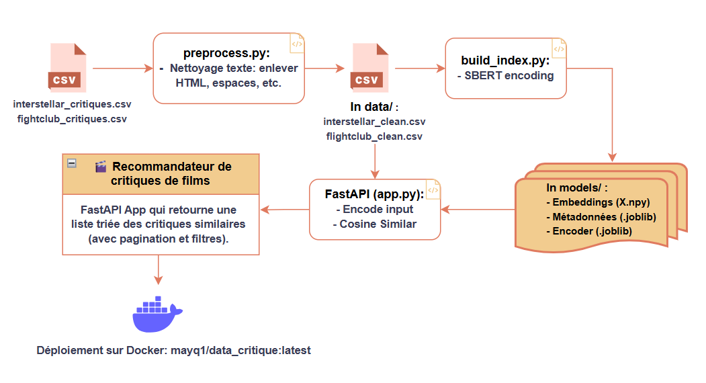
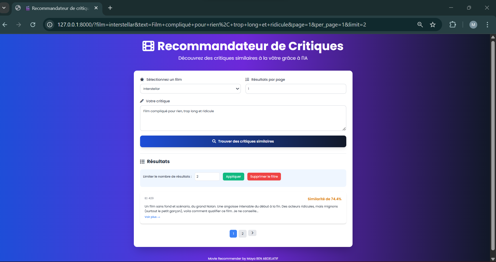
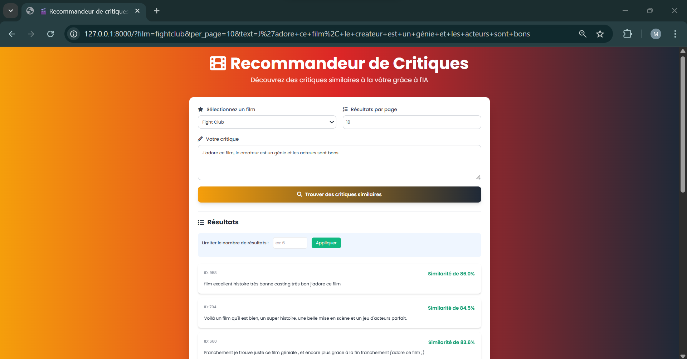

# Recommandeur de Critiques (SBERT + FastAPI)

Ce projet propose un système de recommandation de critiques de films basé sur la similarité sémantique.  
En utilisant **Sentence-BERT (SBERT)**, l’application analyse une critique donnée par un utilisateur et suggère d’autres critiques similaires pour le **même film**; un user qui lit une critique sur *Fight Club* ou *Interstellar* pourra ainsi découvrir d’autres avis proches (positifs ou négatifs).

## Design du système

Pour consulter le design détaillé du fonctionement du système (schéma et explications), veuillez vous rediriger vers le [PDF d'architecture du système](Rapport/Architecture_system.pdf).

---
## Implémentation

### Installation locale
```
git clone https://github.com/tiredoof/Movie-critique-recommender.git
cd Movie-critique-recommender
python -m venv .venv
source .venv/bin/activate   # ou .venv\Scripts\activate sur Windows
pip install -r requirements.txt
```
### Fichiers
- preprocess.py: nettoie les CSV bruts et produit `data/<name>_clean.csv`.
- build_index.py: construit SBERT model et sauvegarde les resultats dans `models/`.
- app.py: User Simulation de FastAPI API pour Film recommendations.
- Dockerfile: Simple pour creer l'image de l'application, elle est au niveau de docker hub: username est mayq1, nom de l'image est mayq1/data_critique:latest.
- requirements.txt: Libs à telecharger pour le bon fonctionnement du code.

### Etapes de realisation du model
1. Verifier que ces 2 CSV bruts sont dans le dossier project root pulled:
   - `interstellar_critique.csv`
   - `fightclub_critique.csv`

2. Nettoyage en utilisant ces commandes Python (les fichiers nettoyés sont deja presents au niveau de github dans le fichier data/):
```
   python preprocess.py --input interstellar_critiques.csv --output data/interstellar_clean.csv
   python preprocess.py --input fightclub_critiques.csv --output data/fightclub_clean.csv
```
3. Construire les models SBERT pour les deux films:
```
   python build_index.py --clean_csv data/interstellar_clean.csv --model_dir models
   python build_index.py --clean_csv data/fightclub_clean.csv --model_dir models
```
4. Lancer l'API avec cette commande:
```
   uvicorn app:app --reload --port 8000
```
5. Tester le bon fonctionnement de l'application:
     soit direct sur : http://127.0.0.1:8000 
     ou, avec la fct GET, par example:
     GET http://127.0.0.1:8000/?film=fightclub&per_page=10&text=J%27adore+ce+film%2C+le+createur+est+un+genie+et+les+acteurs+sont+bons
     
6. Build l'image Docker puis run it avec:
```
   docker build -t mayq1/data_critique:latest .     
   docker run -d -p 8000:8000 mayq1/data_critique:latest  
```

Nous pouvons récapituler l’ensemble de ces étapes dans un schéma descriptif illustrant le processus de conception de cette application:





### Remarques
Pour tester directement l'application, veuillez utiliser l’image Docker déjà buildée:          
```
docker pull mayq1/data_critique:latest  
docker run -d -p 8000:8000 mayq1/data_critique:latest  
```

## Aperçu de l'application

Voici des captures d'écran de l'application en cours d'execution pour les deux films :

### **Interstellar**  




Comme illustré dans la figure ci-dessous, vous pouvez limiter le nombre de critiques affichées en appliquant le filtre "Limiter le nombre de résultats”. Pour revenir à l’affichage complet de toutes les critiques, il suffit de cliquer sur le bouton rouge “Supprimer le filtre”. 

Vous pouvez également contrôler le nombre de critiques visibles par page en sélectionnant la valeur souhaitée dans le champ “Résultats par page”.

### **Fight Club**  


